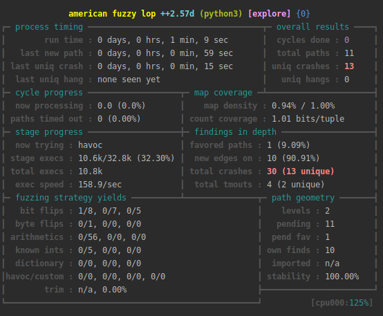

# Quling Unicornafl

Fuzz pretty much anything... at some point.



[fuzz_x8664_linux.py](./fuzz_x8664_linux.py) is a simple example of how to use Qiling together with AFL.

It has been tested with the recent Qiling framework (the one you cloned),
[afl++](https://github.com/vanhauser-thc/AFLplusplus)
and the [unicorn afl for (WIP)](https://github.com/domenukk/unicorn/tree/0cd188142f52afce9f240eff92041947190e1174).

My unicorn fork adds methods (in this case we use `afl_start_forkserver`, although `afl_fuzz` is even more powerful) to kick off the unicorn forkserver at any time.
That means you can fuzz any unicorn projects with one line of code-ish.

This will be, at some point, upstreamed to afl++ once it's ready, but for now, install afl++ and qiling, then
```bash
git clone https://github.com/domenukk/unicorn.git
cd ./unicorn
git checkout 0cd188142f52afce9f240eff92041947190e1174
make -j8
cd ./bindings/python
./setup.py install --user
```

Then come back to this folder, and run `./fuzz.sh`.

Read through [the whole script](fuzz_x8664_linux.py), it should be documented well enough.

Enjoy Fuzzing in Qiling :) 

Feel free to reach out to me at any time :)
